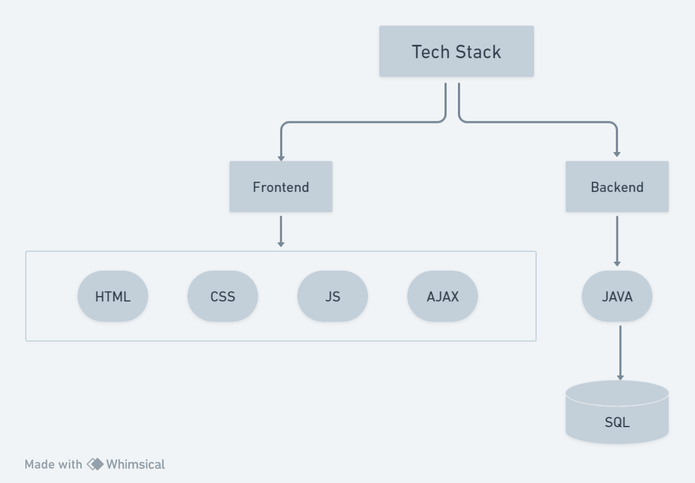
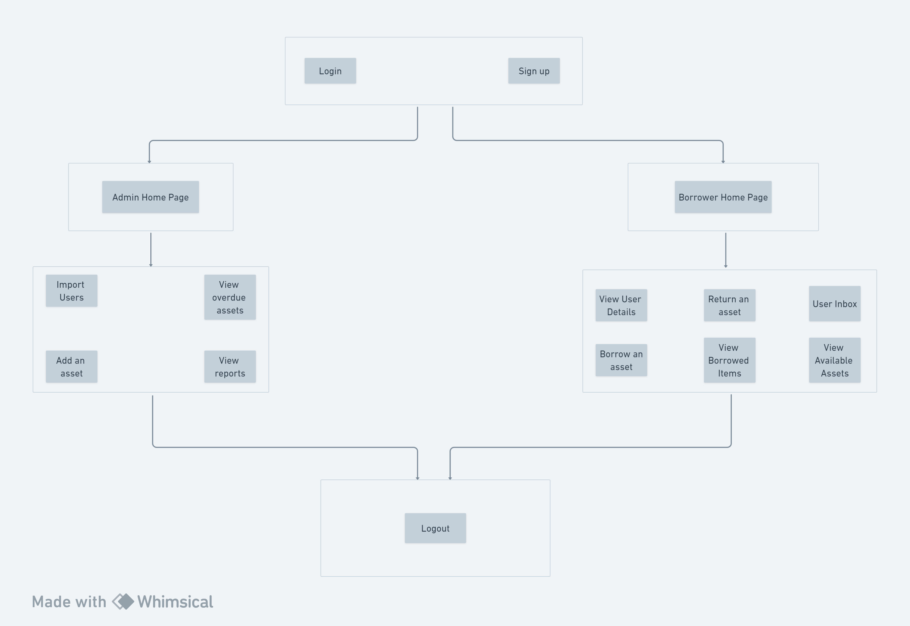
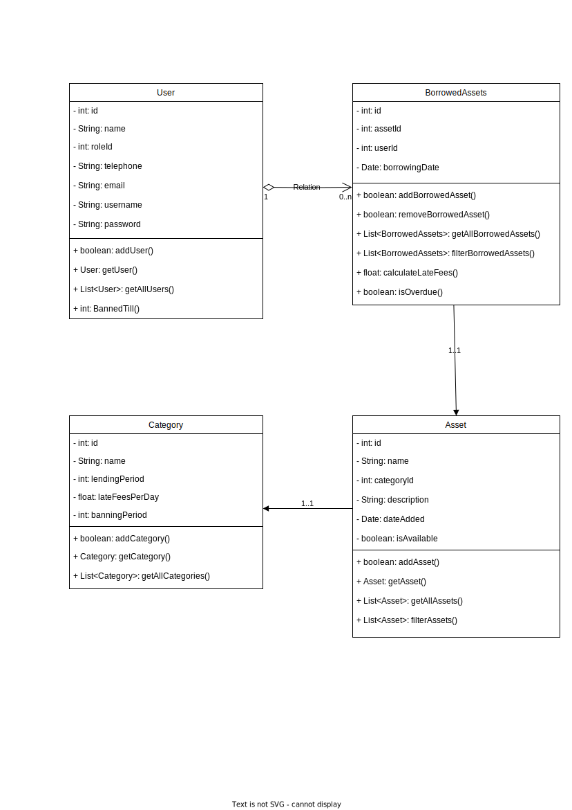
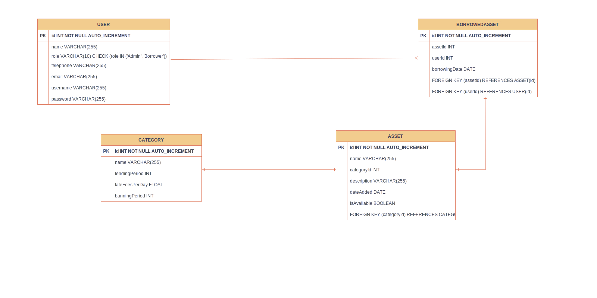

# E-Asset Management

## Tech Stack Used

---

## High Level Architecture



## Class Diagram



## ER Diagram



## Directory Structure
### Frontend
```
|-frontend
   |---assets # fonts/images
   |---components # reusable components like header, footer
   |---css # css of the files
   |---fake_db # data for the website
   |---pages # html pages of the website
   |---scripts # js files of the website
```
### Backend
TODO: Backend structure needs slight rectification
```
|-database_seed.sql # use this to seed the database
```
### Communication and Documentation
```
|-frontend_documentation # directory discusses how the solution needs to be architected (lists requirements)
|-important_images # directory with the ER diagram, class diagram, high-level architecture
|-resolved_issues # documentation of any issues resolved in the duration of the project
|-backend_documentation # an agreement between the backend developers
```

## Gist of the Application
1. Fake Databases: Data for the website is stored in JSON files like user, category, asset, etc.
2. Signup Page:
   - Collects user details including name, email, phone, and role.
   - Validates unique email, matching passwords, and phone/email formats.
3. Login Page:
   - Users log in with a username/email and password.
   - Successful login data is stored in localStorage.
4. Navigation & Head Bar:
   - Links for user management and logout.
   - Displays website logo and product name.
5. Footer: Contains miscellaneous links.
6. Import Users Page: Admins import and validate user data from JSON/XML formats.
7. Admin Homepage: Shows logged-in admin's data and provides asset management tools.
8. Overdue Assets Page: 
   - Displays overdue assets with filtering options.
   - Admins can message borrowers about overdue assets.
9. Reports Page: 
   - Admins view assets distribution charts and tables of overdue borrowers.
10. Employee Homepage: 
   - Shows logged-in employee data and lists borrowed items.
   - Employees can search and allocate assets.
11. Logout: Functionality for users and admins to exit the application.
12. Data Retrieval: Data is fetched from either JSON files or overridden with data from localStorage when available.

In essence, the system is a web application enabling user and asset management, with functionalities to sign up, log in, manage assets, and view reports, using a combination of JSON files and localStorage.

## Frontend Walkthrough
1. Go here: https://psymbio.github.io/e_asset_management/frontend/pages/
2. To login as Admin use the credentials
```
email: admin@example.com
password: admin 
```
3. To login as a Borrower use the credentials
```
email: john.doe@example.com
password: Password@123
```
4. Or you can create your own account.
### Admin Login

### Borrower Login


## Backend Walkthrough
TODO

## Frontend Testing
TODO

## Backend Testing
TODO