# Asset Vault

## Tech Stack Used

---

## High Level Architecture


## Class Diagram


## ER Diagram


## Directory Structure
### Frontend
```
|-frontend
   |---assets # fonts/images
   |---components # reusable components like header, footer
   |---css # css of the files
   |---fake_db # data for the website
   |---pages # html pages of the website
   |---scripts # js files of the website
```
### Backend
```
|-EAssetManagement
   |---EAssetManagement
   |-----bin
   |-----src
   |-------com
   |---------easset
   |-----------entity # all the beans
   |-----------exceptions # all the possible exceptions of the program
   |-----------service # handles controlling the database
   |-----------storage # talks to the database
   |-----------utils # filter function interfaces
   |-----------view # the main exists here
   |---bin
|-database_seed.sql # use this to seed the database
```
### Communication and Documentation
```
|-frontend_documentation # directory discusses how the solution needs to be architected (lists requirements)
|-important_images # directory with the ER diagram, class diagram, high-level architecture
|-resolved_issues # documentation of any issues resolved in the duration of the project
|-backend_documentation # an agreement between the backend developers
```

## Gist of the Application
1. Fake Databases: Data for the website is stored in JSON files like user, category, asset, etc.
2. Signup Page:
   - Collects user details including name, email, phone, and role.
   - Validates unique email, matching passwords, and phone/email formats.
3. Login Page:
   - Users log in with a username/email and password.
   - Successful login data is stored in localStorage.
4. Navigation & Head Bar:
   - Links for user management and logout.
   - Displays website logo and product name.
5. Footer: Contains miscellaneous links.
6. Import Users Page: Admins import and validate user data from JSON/XML formats.
7. Admin Homepage: Shows logged-in admin's data and provides asset management tools.
8. Overdue Assets Page: 
   - Displays overdue assets with filtering options.
   - Admins can message borrowers about overdue assets.
9. Reports Page: 
   - Admins view assets distribution charts and tables of overdue borrowers.
10. Employee Homepage: 
   - Shows logged-in employee data and lists borrowed items.
   - Employees can search and allocate assets.
11. Logout: Functionality for users and admins to exit the application.
12. Data Retrieval: Data is fetched from either JSON files or overridden with data from localStorage when available.

In essence, the system is a web application enabling user and asset management, with functionalities to sign up, log in, manage assets, and view reports, using a combination of JSON files and localStorage.

## Frontend Walkthrough
1. Go here: https://psymbio.github.io/e_asset_management/frontend/pages/
2. To login as Admin use the credentials
```
email: admin@example.com
password: admin 
```
3. To login as a Borrower use the credentials
```
email: john.doe@example.com
password: Password@123
```
4. Or you can create your own account.

### Admin Login
You can view the Overdue Assets table and the Reports
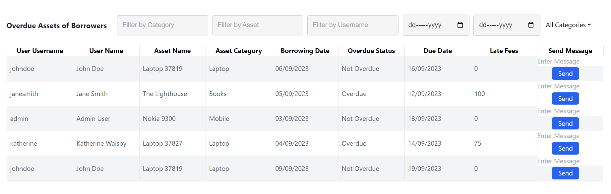
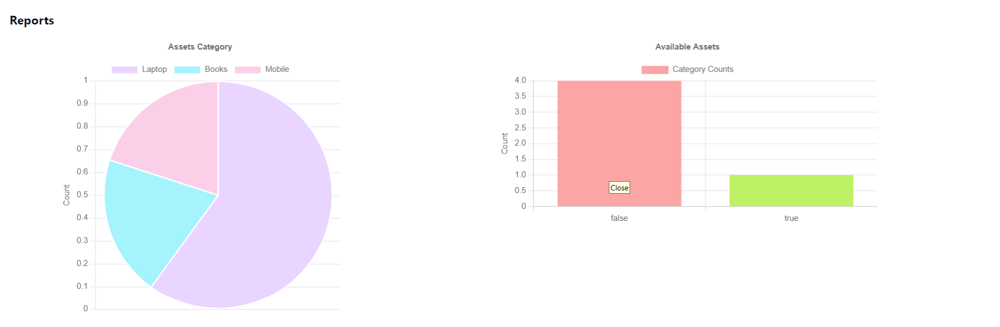

You can send the user a message
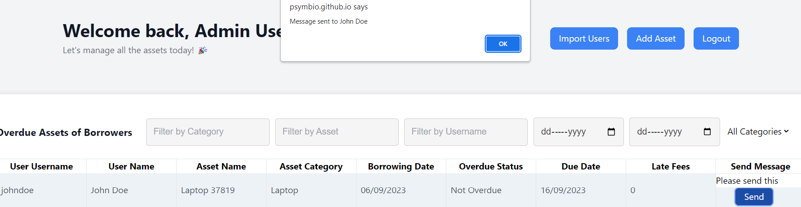

You can filter the overdue asset table
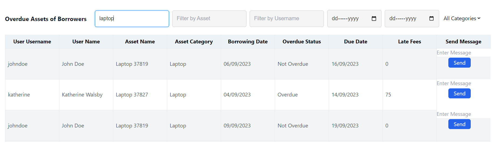

You can import users
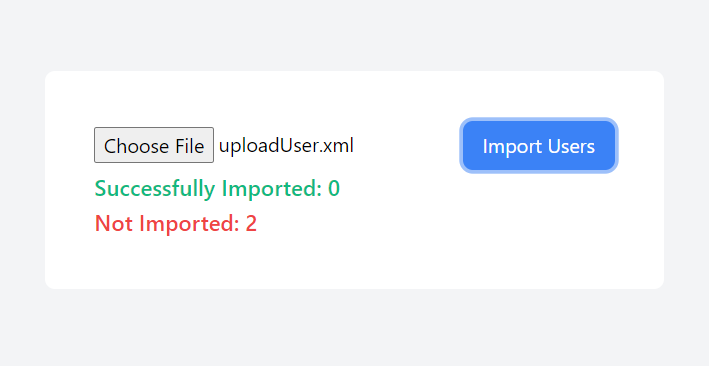

You can add an asset and category
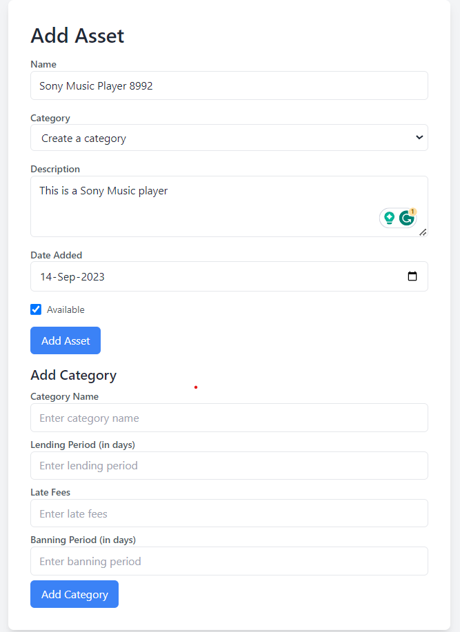

### Borrower Login
You can view your information, when you last logged in
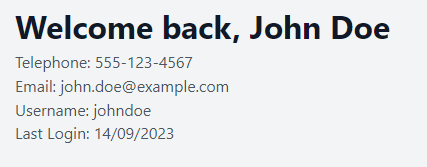

You can view your inbox
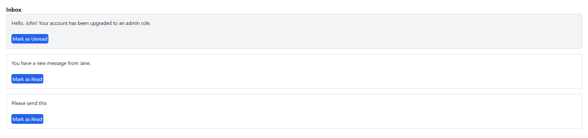

You can view the assets you borrowed
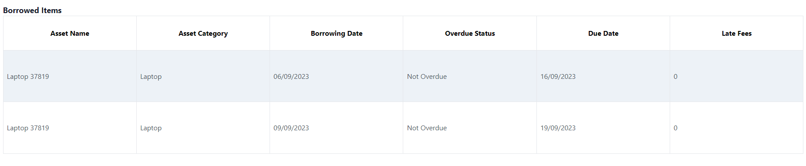

You can view all the available assets
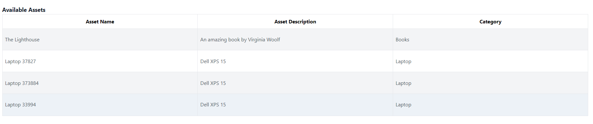

You can borrow an asset
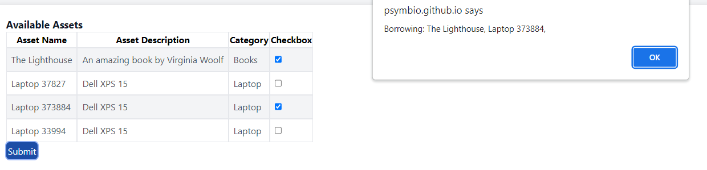

You can return an asset
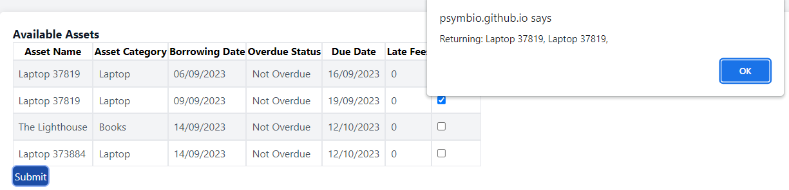

## Backend Walkthrough
1. Change the credentials in the com.easset.storage inside Credentials.java as per your system's database.
2. Seed your database using `database_seed.sql`
3. Login as Admin with userId = 1
4. Login as Borrower with userId = 2
5. You can borrow assets, create assets and categories, create users as an admin.
6. You can borrow assets as a user.

## Frontend Testing
| S. no. | Role     | Feature                                     | Input                                                            | Output                                         |
|--------|----------|---------------------------------------------|------------------------------------------------------------------|------------------------------------------------|
| 1      | Admin    | Login                                       | email: admin@example.com password: admin                         |      |
| 2      | Admin    | Send email                                  | Message to John Doe: send this back                              |        |
| 3      | Admin    | Add asset                                   | Add new asset                                                    |  |
| 4      | Admin    | Overdue Table                               | No input                                                         |      |
| 5      | Admin    | Reports                                     | No input                                                         |             |
| 6      | Admin    | Import Users                                | uploadUser.xml                                                   |        |
| 7      | Borrower | Login                                       | email: john.doe@example.com password: Password@123               |                                                |
| 8      | Borrower | See user information                        | No input                                                         |           |
| 9      | Borrower | See inbox and mark messages read and unread | Mark messages as unread and read See new messages from the admin |          |
| 10     | Borrower | See borrowed assets and available assets    | No input                                                         |     |
| 11     | Borrower | Borrow or return an asset                   | Checkbox input to borrow or return assets                        |        |
|        |          |                                             |                                                                  |                                                |

## Backend Testing
| S.No |   Role   |       Function       |            Output           |
|:----:|:--------:|:--------------------:|:---------------------------:|
|   1  |   Admin  |  Get all categories  |  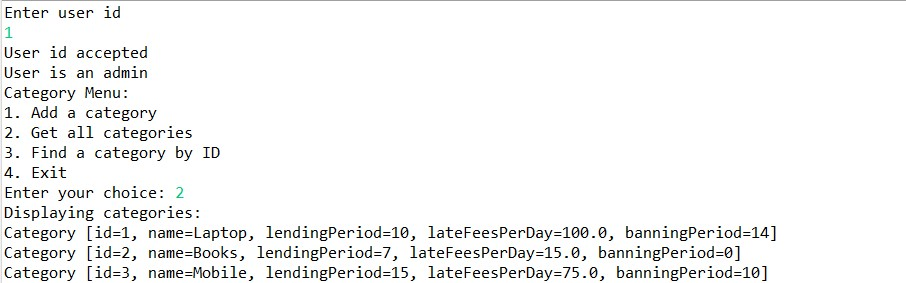 |
|   2  |   Admin  |   Add new category   | 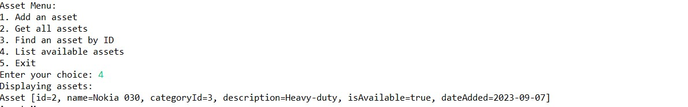 |
|   3  | Borrower |    List all assets   | 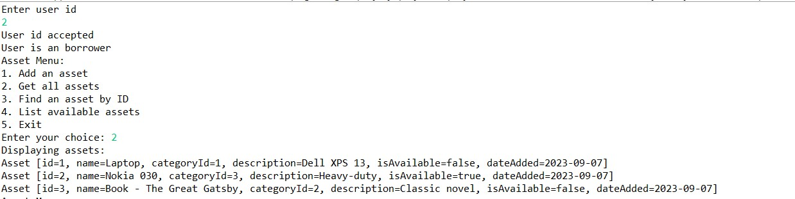 |
|   4  | Borrower | Get available assets | 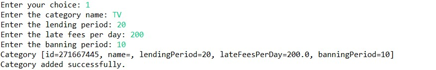 |