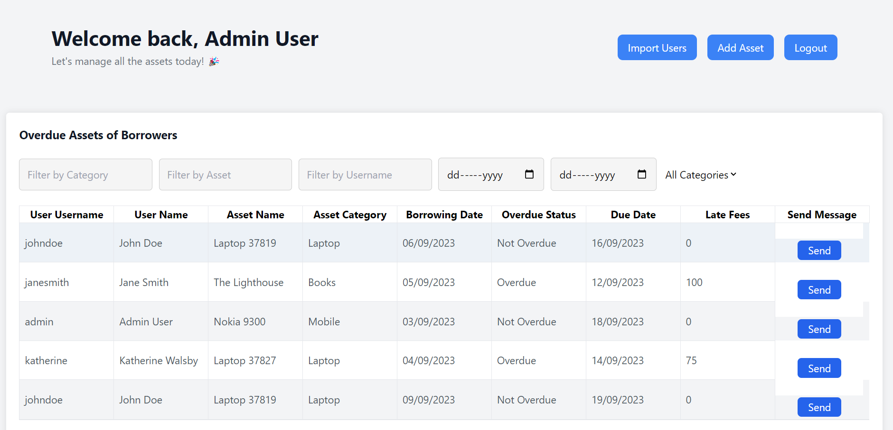

Make the borrower home page format similar to the homeadmin page:

Instead of the "Import Users"  and "Add Asset" button add the "Borrow Asset" and "Return Asset" button.

Write the "Borrow Asset" and "Return Asset" functionality completely - only access localStorage data for this.
